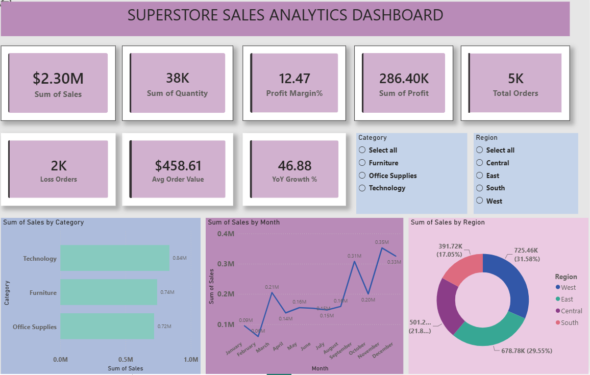
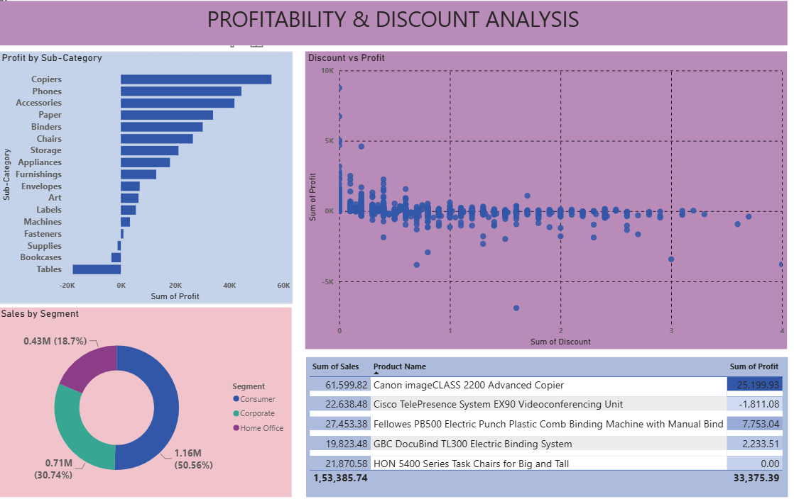

# Superstore Sales Analytics — End-to-End Data Analytics Project

## Project Overview
Analyzed 9,994 rows of retail sales data to uncover business insights 
on profitability, regional performance, and seasonal trends using 
SQL, Python, Excel, Power BI and Machine Learning.

## Tools Used
| Tool | Purpose |
|------|---------|
| SQL (MySQL) | Database design, 15 business queries |
| Python (Pandas, Seaborn) | EDA, data cleaning, 8 visualizations |
| Excel | KPI dashboard, pivot tables, 4 charts |
| Power BI | 2-page interactive dashboard, 5 DAX measures |
| Machine Learning | Sales prediction, profit classification |

## Key Business Insights
- Technology has the highest profit margin (17%)
- Tables sub-category sells at a net loss (-$17,725)
- Q4 (Nov-Dec) drives ~30% of annual revenue
- Discounts above 20% result in negative average profit
- West region leads in both sales (32%) and profit

## Machine Learning Models
| Model | Purpose | Result |
|-------|---------|--------|
| Linear Regression | Predict sales amount | MAE = $269 |
| Logistic Regression | Classify profitable orders | Accuracy = 83% |

## Dashboard Screenshots

## Project Files
- superstore_analysis.sql — SQL schema and 15 business queries
- superstore_eda.py — Python EDA script
- Superstore_Sales_Analysis.ipynb — Python EDA notebook
- superstore_ml.py — Machine Learning script
- Superstore_ml.ipynb — Machine Learning notebook
- superstore_project.pbix — Power BI dashboard

## Dataset
Kaggle Superstore Dataset — 9,994 rows, 21 columns
https://www.kaggle.com/datasets/vivek468/superstore-dataset-final
